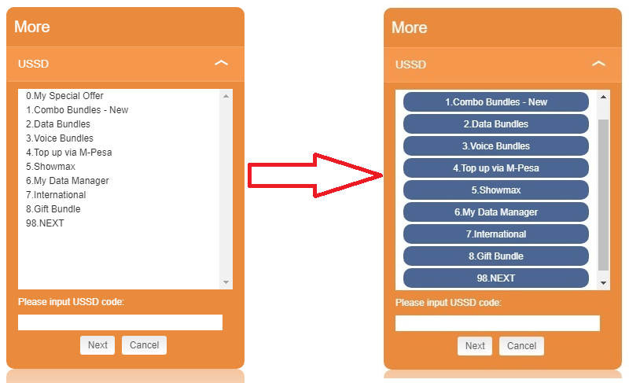

# Alcatel MW40 MIFI USSD Enhancement Userscript
This userscript converts text based USSD responses to buttons that you can click on to quickly make selections.

You can install it using a Userscript Manager such as Tampermonkey, Greasemonkey, etc.

URLS to match: http://192.168.1.1/* and http://telenormi-fi.home/*

